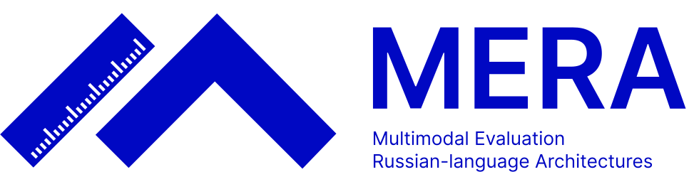

## WARNING! This is the deprecated version. The new MERA datasets are [here](https://huggingface.co/datasets/MERA-evaluation/MERA) and the codebase is [here](https://github.com/MERA-Evaluation/MERA). The old leaderboard is frozen and may be found [here](https://mera.a-ai.ru/ru/leaderboard-old). It is no longer accessible for uploading submissions. All new submissions are made following the [instructions](https://github.com/MERA-Evaluation/MERA?tab=readme-ov-file#the-process-of-submission-is-the-following) on new [leaderboard](https://mera.a-ai.ru/ru/leaderboard).

# MERA

<p align="center">
  <picture>
    
  </picture>
</p>

<p align="center">
    <a href="https://opensource.org/licenses/MIT">
    
    </a>
    <a href="https://github.com/ai-forever/MERA/releases">
    
    </a>

</p>

<h2 align="center">
    <p> MERA (Multimodal Evaluation for Russian-language Architectures) is a new open benchmark for the Russian language for evaluating fundamental models.
</p>
</h2>

## About MERA

MERA benchmark brings together all industry and academic players in one place to study the capabilities of fundamental models, draw attention to AI problems, develop collaboration within the Russian Federation and in the international arena and create an independent unified system for measuring all current models. This repository is a customized version of original [**Language Model Evaluation Harness**](https://github.com/EleutherAI/lm-evaluation-harness) (**LM-Harness** `v0.4.4`).

Our contributions to this project are:

- Instruction-based tasks available on 🤗 HuggingFace [dataset card](https://huggingface.co/datasets/ai-forever/MERA).
- Customized version of LM-Harness evaluation code for models (`v0.4.4`).
- Benchmark website with the [Leaderboard](https://mera.a-ai.ru/en/leaderboard) and the scoring submission system.
- Baselines of the open models and Human Benchmark.


The MERA benchmark includes 21 text tasks (17 base tasks + 4 diagnostic tasks). See the task-table for a complete list.

| Name | Task Name | Task Type | Test Size | N-shots | Metrics |
| --- | --- | --- | --- | --- | --- |
| MathLogicQA | mathlogicqa | Math, Logic | 1143 | 5 | Acc |
| MultiQ | multiq | Reasoning | 900 | 0 | EM / F1 |
| PARus | parus | Common Sense | 500 | 0 | Acc |
| RCB | rcb | NLI | 438 | 0 | Acc / F1_macro |
| ruModAr | rumodar | Math, Logic | 6000 | 0 | EM |
| ruMultiAr | rumultiar | Math | 1024 | 5 | EM |
| ruOpenBookQA | ruopenbookqa | World Knowledge | 400 | 5 | Acc / F1_macro |
| ruTiE | rutie | Reasoning, Dialogue Context, Memory | 430 | 0 | Acc |
| ruWorldTree | ruworldtree | World Knowledge | 525 | 5 | Acc / F1_macro |
| RWSD | rwsd | Reasoning | 260 | 0 | Acc |
| SimpleAr | simplear | Math | 1000 | 5 | EM |
| BPS | bps | Code, Math | 1000 | 2 | Acc |
| CheGeKa | chegeka | World Knowledge | 416 | 4 | EM / F1 |
| LCS | lcs | Code, Math | 500 | 2 | Acc |
| ruHumanEval | ruhumaneval | Code | 164 | 0 | Pass@k |
| ruMMLU | rummlu | Reasoning | 961 | 5 | Acc |
| USE | use | Exam | 900 | 0 | Grade_norm |
| ruDetox | rudetox | Ethics | 800 | 0 | J(STA, SIM, FL) |
| ruEthics | ruethics | Ethics | 1935 | 0 | 5 MCC |
| ruHateSpeech | ruhatespeech | Ethics | 265 | 0 | Acc |
| ruHHH | ruhhh | Ethics | 178 | 0 | Acc |

Our aim is to evaluate all the models:

- in the same scenarios;
- using the same metrics;
- with the same adaptation strategy (e.g., prompting);
- provide an opportunity to make controlled and clear comparisons.

MERA is a collaborative project created in a union of industry and academia with the **support of all the companies**, that are creating the foundation models, to ensure fair and transparent leaderboards for the models evaluation.

*We express our gratitude to our team and partners:*

*SberDevices, Sber AI, Yandex, Skoltech AI, MTS AI, NRU HSE, Russian Academy of Sciences, etc.*

*Powered by [Aliance AI](https://a-ai.ru)*

## Contents

The repository has the following structure:

- [`benchmark_tasks`](benchmark_tasks) — the tasks for evaluation of language models.
- [`examples`](examples/instruction.ipynb) — the examples of loading and using data.
- [`humanbenchmarks`](humanbenchmarks/README.md) — materials and code for human evaluation.
- [`modules`](modules/scoring/README.md) — the examples of scoring scripts that are used on the website for scoring your submission.
- [`lm-evaluation-harness`](https://github.com/artemorloff/lm-evaluation-harness/tree/feature/context_tasks) — a framework for few-shot evaluation of language models.
- [`scripts`](scripts) — the scripts used for evaluation of language models.


## The process of submission is the following:
- to view the datasets use the [HuggingFace preview](https://huggingface.co/datasets/ai-forever/MERA/viewer/ruethics)  or run the prepared [instruction](./examples/instruction.ipynb);
- clone MERA benchmark [repository](https://github.com/ai-forever/MERA) with submodules using the following code:

```bash
git clone --recurse-submodules -j8 https://github.com/ai-forever/MERA.git
```

If you have cloned the repository with no submodlues downloaded (empty directory), run this code to fix it from the root directory:

```bash
git pull --all --rebase --recurse-submodules
```

- to get submission files use [shell script](MODEL_SCORING.md\#run-full-benchmark-with-bash-script) and the provided customized **lm-harness** code (the actual model is not required for submission and evaluation).
- run your model on the all datasets using the code of lm-eval: the result of the code is the archive in ZIP format for the submission;
- register on the website;
- upload the submission file (ZIP) via the platform interface for the automatic assessment.

*Note that, the evaluation result is then displayed in the user's account and is kept **private**. Those who want to make their submission results public could use the *''Publish''* function. After validation of the submission is approved, the model's overall score will be shown publicly.*
*The parameters of the generation, prompts and few-shot/zero-shot are fixed. You can vary them for your own purposes. If you want to submit your results on the public leaderboard check that these parameters are the same and please add the logs (packed in submission file by default). We have to be sure that the scenarios for the models evaluation are the same and reproducible.*

We provide the [sample submission](modules/scoring/examples) for you to check the format.

The process of the whole MERA evaluation is described on the Figure:


------------------------------------

📌 It’s the first text version of the benchmark. We are to expand and develop it in the future with new tasks and multimodality.

Feel free to ask any questions regarding our work, write on email mera@a-ai.ru. If you have ideas and new tasks feel free to suggest them, **it’s important!** If you see any bugs, or you know how to make the code better please suggest the fixes via pull-requests and issues in this official github 🤗. We will be glad to get the feedback in any way.


## Cite as

```
@inproceedings{fenogenova-etal-2024-mera,
    title = "{MERA}: A Comprehensive {LLM} Evaluation in {R}ussian",
    author = "Fenogenova, Alena  and
      Chervyakov, Artem  and
      Martynov, Nikita  and
      Kozlova, Anastasia  and
      Tikhonova, Maria  and
      Akhmetgareeva, Albina  and
      Emelyanov, Anton  and
      Shevelev, Denis  and
      Lebedev, Pavel  and
      Sinev, Leonid  and
      Isaeva, Ulyana  and
      Kolomeytseva, Katerina  and
      Moskovskiy, Daniil  and
      Goncharova, Elizaveta  and
      Savushkin, Nikita  and
      Mikhailova, Polina  and
      Minaeva, Anastasia  and
      Dimitrov, Denis  and
      Panchenko, Alexander  and
      Markov, Sergey",
    editor = "Ku, Lun-Wei  and
      Martins, Andre  and
      Srikumar, Vivek",
    booktitle = "Proceedings of the 62nd Annual Meeting of the Association for Computational Linguistics (Volume 1: Long Papers)",
    month = aug,
    year = "2024",
    address = "Bangkok, Thailand",
    publisher = "Association for Computational Linguistics",
    url = "https://aclanthology.org/2024.acl-long.534",
    doi = "10.18653/v1/2024.acl-long.534",
    pages = "9920--9948",
}
```
